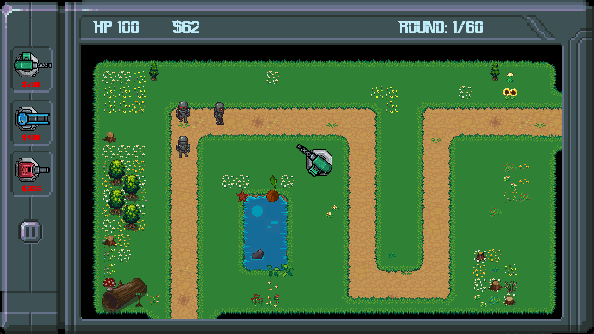

# Robot Invasion Defence II

Robot Invasion Defence II on klassinen tower defence peli, jossa pelaajan täytyy suojautua robottien hyökkäykseltä käytämällä torneja. Pelin ensimmäinen osa: [Robot Invasion Defence](https://github.com/3nd3r1/robot-invasion-defence)

## Python versio

Pelin suorittaminen lähdekoodista on parasta tehdä Python-versiolla `3.8`.
Kaikki moduulit eivät toimi liian uusilla tai vanhoilla Python-versiolla.

## Dokumentaatio

-   [Käyttöohje](./robot-tower-defence-2/dokumentaatio/kayttoohje.md)
-   [Vaatimusmäärittely](./robot-tower-defence-2/dokumentaatio/vaatimusmaarittely.md)
-   [Tuntikirjanpito](./robot-tower-defence-2/dokumentaatio/tuntikirjanpito.md)
-   [Changelog](./robot-tower-defence-2/dokumentaatio/changelog.md)
-   [Arkkitehtuuri](./robot-tower-defence-2/dokumentaatio/arkkitehtuuri.md)
-   [Testausdokumentti](./robot-tower-defence-2/dokumentaatio/testaus.md)
-   [Credits](./robot-tower-defence-2/dokumentaatio/credits.md)

## Releaset

Pelin uusin release: [viikko 6](https://github.com/3nd3r1/ot-harjoitustyo/releases/tag/viikko6)

## Screenshot

## Taskit

### Pelinsuoritus

`poetry run invoke start`

### Pelin debuggaus

`poetry run invoke debug`

### Windows tuotantoympäristön luominen

`poetry run invoke build`

### Testit

`poetry run invoke test`

### Testikattavuusraportti

`poetry run invoke coverage-report`

### Pylint-tarkastus

`poetry run invoke lint`
