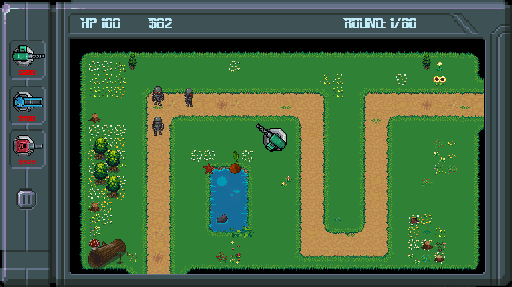

# Robot Invasion Defence II

Robot Invasion Defence II on klassinen tower defence peli, jossa pelaajan täytyy suojautua robottien hyökkäykseltä käytämällä torneja. Pelin ensimmäinen osa: [Robot Invasion Defence](https://github.com/3nd3r1/robot-invasion-defence)

## Kieli

Tämä README.md on myös luettavissa englanniksi [täällä](./README.md)

## Python versio

Pelin suorittaminen lähdekoodista on parasta tehdä Python-versiolla `3.8`.
Kaikki moduulit eivät toimi liian uusilla tai vanhoilla Python-versiolla.

## Dokumentaatio

-   [Käyttöohje](./docs_fi/kayttoohje.md)
-   [Vaatimusmäärittely](./docs_fi/vaatimusmaarittely.md)
-   [Tuntikirjanpito](./docs_fi/tuntikirjanpito.md)
-   [Changelog](./docs_fi/changelog.md)
-   [Arkkitehtuuri](./docs_fi/arkkitehtuuri.md)
-   [Testausdokumentti](./docs_fi/testaus.md)
-   [Credits](./docs_fi/credits.md)

## Releaset

Pelin uusin release: [1.1.0](https://github.com/3nd3r1/robot-invasion-defence-2/releases/tag/1.1.0)

## Screenshot

## Taskit

### Pelinsuoritus

`poetry run invoke start`

### Pelin debuggaus

`poetry run invoke debug`

### Windows tuotantoympäristön luominen

`poetry run invoke build`

### Testit

`poetry run invoke test`

### Testikattavuusraportti

`poetry run invoke coverage-report`

### Pylint-tarkastus

`poetry run invoke lint`
