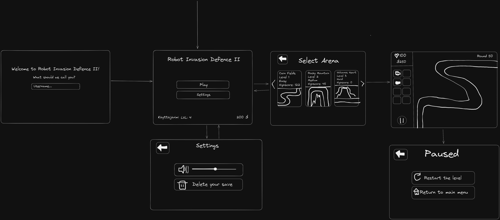

# Robot Invasion Defence 2 - Specifications

## Purpose of the Application

The application is a classic Tower Defence game where the player tries to defend against robot attacks by placing towers on the field.

The application features multiple towers that the player can use to play the game, such as turrets, cannons, missile launchers, etc.

The application includes different types of robots from which the player needs to defend.

The application has multiple arenas or game levels with different paths for the robots. The arenas may also have other differences that affect gameplay.

## Interface Sketch

## Basic Version Functionality

### Data Storage

-   User data is stored locally in an SQLite database.
    -   This file contains the user's level and currencies.
    -   This file contains game saves.

### Menu

-   The menu view displays basic user information (currencies and level).
-   From the menu view, the user can select the level to start the game.

### Game

-   The user has game-specific lives.
    -   Lives are visible in the view.
    -   Lives decrease when robots pass through.
-   The user has game-specific currency.
    -   Currency is displayed in the view.
    -   Currency increases by destroying robots.
-   The user can pause the game.
    -   During the pause, the user can quit the game.
-   The user can win or lose the game.
    -   The user loses when lives reach zero.
    -   The user wins by reaching a certain level.
-   The user can place towers.
    -   Towers are functional.

## Future Development Ideas

The basic version can be enhanced with the following functionalities:

### Data Storage

-   User's basic information is stored in the cloud.
-   User's game saves are stored as local files.
-   Adding the player's name.

### Menu

-   From the menu view, access to settings.
    -   Settings allow changing the volume.
    -   Settings allow deleting the save file.
-   From the menu view, access to the in-game store.
    -   In the store, players can buy outfits using in-game currency.

### Game

-   Add different types of towers:
    -   Laser tower.
-   Add different arenas:
    -   Peaky Mountains.
    -   Burning Volcano.
-   Add different types of robots.
-   Fast forward button.
-   Allow users to modify their towers:
    -   Users can remove/sell towers.
    -   Users can upgrade towers.
-   Improve the generation of game rounds.
-   Improve statistics for robots and towers (balance).
