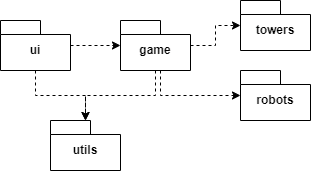
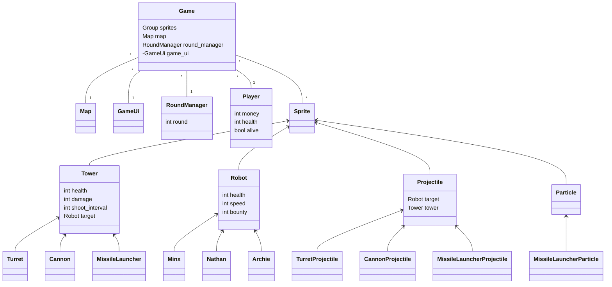
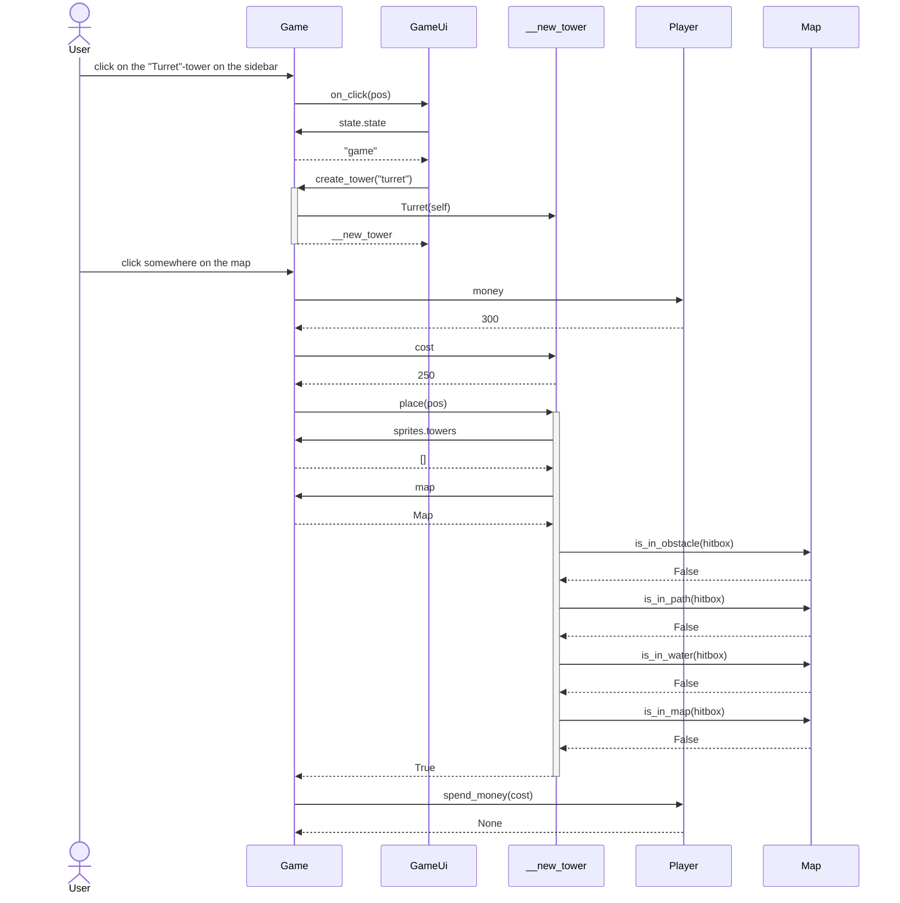

# Architecture Description

## Structure

### Package Diagram Illustrating the Directory Structure of the Game

-   The _ui_ directory contains the user interface code, which includes all the different menus and the _GameUi_ class responsible for the in-game interface.

-   The _game_ directory contains all the code related to the game, including sprites (i.e., different game characters), the game field, and the _RoundManager_ class responsible for managing rounds.

-   The _towers_ directory contains classes for different types of towers. Each type of tower has its own class that inherits from the abstract _Tower_ class.

-   The _robots_ directory contains classes for different types of robots. Each type of robot has its own class that inherits from the abstract _Robot_ class.

-   The _utils_ directory contains static code that can be used in any part of the program. The _utils_ directory includes, for example, the database connection and methods for file reading.

### Class Diagram Illustrating the Structure of the Game:

Here's the `Game` class, which is the main class of the game and contains all the classes related to the game.

Abstract classes `Tower`, `Robot`, `Projectile`, and `Particle` correspond to all the sprites or elements that make up the game.

The `Player` class handles all player-related aspects such as lives and money.

The `RoundManager` class is responsible for creating robots in each round.

The `Map` class handles the construction and drawing of the game field. The `Map` class takes the arena as a parameter and creates the game field accordingly.

The `GameUi` class handles the in-game user interface.

## User Interface

The user interface consists of different menus and the game view itself. The user interface is divided into two main classes:

### 1. `Menu` class

This class is responsible for all the menus displayed before starting the game. The `Menu` class displays the player's level and money, and it also includes several static classes representing different menu views such as the main menu (`MainMenu`) and the start game menu (`StartGameMenu`).

### 2. `GameUi` class

This class is responsible for the in-game user interface. The `GameUi` class displays the player's lives, money, and round, and it also includes the interface for placing towers. Additionally, the `GameUi` class includes several static classes representing different game views such as the lose menu (`LoseMenu`), win menu (`WinMenu`), and pause menu (`PauseMenu`).

## Persistence

The `db.py` file is located in the `utils` directory and contains methods responsible for saving player data to an SQLite database. The database location is read from the `config.py` file, but it can also be changed using the `.env` file to use a different database for testing.

The `.env` file has two settings that can be modified as needed: `debug` and `database_pathname`.

### Database

The structure of the SQLite database is as follows:

#### Table: player

The `player` table contains the general information of the player. Since there is only one player in the local game, the table has only one row with the player's ID set to 1.

| Name       | Type    | Description                      |
| ---------- | ------- | -------------------------------- |
| id         | integer | Unique identifier of the player. |
| coins      | integer | Player's amount of money.        |
| experience | integer | Player's level.                  |

#### Table: player_scores

The `player_scores` table contains the information about the player's achieved scores. Each row represents one game session and includes the player's ID, the arena where the score was achieved, and the achieved score.

| Name      | Type    | Description                                                |
| --------- | ------- | ---------------------------------------------------------- |
| player_id | integer | Unique identifier of the player to whom the score relates. |
| arena_id  | text    | Identifier of the arena where the score was achieved.      |
| score     | integer | The score, which represents the achieved round number.     |

#### Table: game_saves

The `game_saves` table contains the information about saved game sessions. Each row corresponds to one saved game session and includes the player's ID, the arena of the saved game, the saved round number, the saved state of the sprites, the saved state of the player object, and the saved state of the `RoundManager` object.

| Name         | Type    | Description                                               |
| ------------ | ------- | --------------------------------------------------------- |
| player_id    | integer | Unique identifier of the player to whom the save relates. |
| arena_id     | text    | Identifier of the arena where the game was saved.         |
| round_num    | integer | The round number of the saved game.                       |
| sprites_data | text    | The saved state of the sprite objects.                    |
| player_data  | text    | The saved state of the player object.                     |
| rounds_data  | text    | The saved state of the `RoundManager` object.             |

## Main Functionality

### Placing a Tower on the Field

When the player selects a new tower from the user interface and clicks on the game field, the application proceeds as follows:

In the first stage, the user clicks on the "Turret" tower in the game's sidebar, triggering a chain of events. The user's click is passed to the game, which then forwards it to the game's user interface. The user interface requests the game's state, after which the game creates a new tower upon the interface's request.

In the second stage, the user clicks on the map at the location where the new tower is desired to be placed. The game needs to check if the player has enough money to purchase the tower. The player provides information to the game about the available amount of money. The game also needs to determine the price of the new tower. After that, the game requests the new tower to be placed at the desired location. Before placing the tower, the game must ensure that the location is valid, meaning it is not obstructed by an obstacle, on a path, or in water. The map handles these inquiries, and once all checks are completed, the tower is placed on the map. The game deducts the tower's price from the player.

### Other functionalities

Other functionalities are implemented following the same pattern as placing a tower. During the game, the `Game` class handles all pygame events and executes corresponding event handlers. In the menu, the `Menu` class performs the corresponding processing.

## Weaknesses of the Program

### User Interface

The architecture of the user interface is not entirely intuitive and contains repetitive elements. For example, the division between the `Menu` and `GameUi` classes may not be optimal, as the `LoseMenu` and `WinMenu` classes could be part of the `Menu` class. Additionally, static views could be implemented more effectively.

### Persistence

The implementation of persistence is the weakest part of the program's structure. Using a local database may not be an intuitive solution, and a better alternative would be an online database that contains all player data and can be accessed through a separate API. Additionally, game saves could be stored in local files, which could be more convenient.

A `PlayerRepository` class could have been added between the program's code and the database handling, providing methods for manipulating player data without directly using SQL queries to the database. This would help reduce code complexity and enable easier database switching in the future if needed.
§
