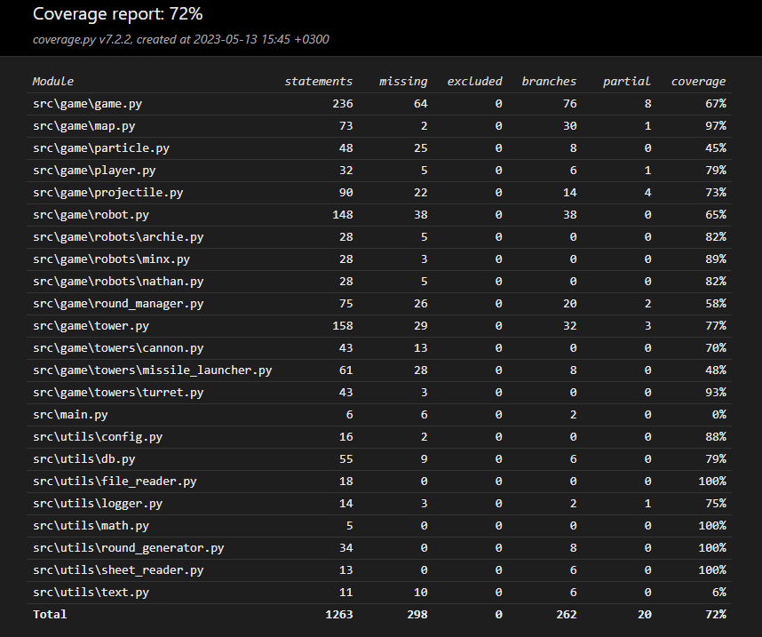

# Test Documentation

The program has been tested with automated unit tests and manual system tests.

## Unit Tests

### Robots

The functionality of the Robot class has been tested with the TestRobot class. The class is initialized by creating a new Game instance with the "grass_fields" arena and creating one "minx" robot and one "turret" tower.

The tests ensure that robots die and player lives decrease when robots reach the end of the path.

### Towers

The functionality of the Tower class has been tested with the TestTower class. The class is initialized by creating a new Game instance with the "grass_fields" arena and creating one "minx" robot and one "turret" tower.

The tests ensure that towers can only be placed in valid locations on the field. Additionally, shooting and targeting of towers are tested.

### Game

The general functionality of the Game class has been tested with the TestGame class.
The test uses the .env.test file to use a separate database for testing instead of the actual database.
The class is initialized by clearing the database, creating a new Game instance with the "grass_fields" arena, creating 3 different types of robots and towers, decreasing player lives by 20, and increasing money by 50.

The first test ensures that the game can be saved and the saved data can be loaded without errors. It also verifies that the loaded data matches the state of the game at the time of saving.

The second test ensures that the game is lost when player lives reach zero.

### Test Coverage

The test coverage without the user interface is 72%.

The main.py file is excluded from automated testing as it is the program's entry point.

The logic related to the Pygame display is not covered by automated testing. For this part, tests could be done manually by clicking on the display and drawing different game situations. The click module could be used to simulate manual clicks on the Pygame display.

## System Testing

System testing has been performed manually on both Windows and Linux environments to ensure that the application works properly on different operating systems.

All the functionalities defined in the [specifications](./specs.md) have been tested manually. Additionally, various scenarios and clicks have been tested for possible errors.

## Known Issues

The application does not provide any error messages to the user in the production environment. This can cause confusion for users if any part of the application is not functioning correctly.
This can be addressed by adding an error message window that informs the user about what prevents the game from running if something goes wrong.

Furthermore, the configurations could be improved. Currently, configurations are only in two fields in the .env file. Consideration could be given to other configuration options to make the application easier to modify and maintain.
