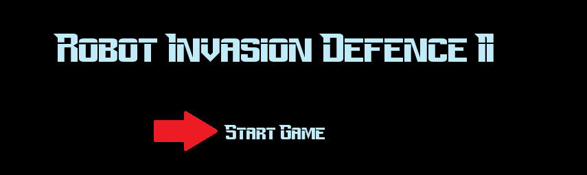
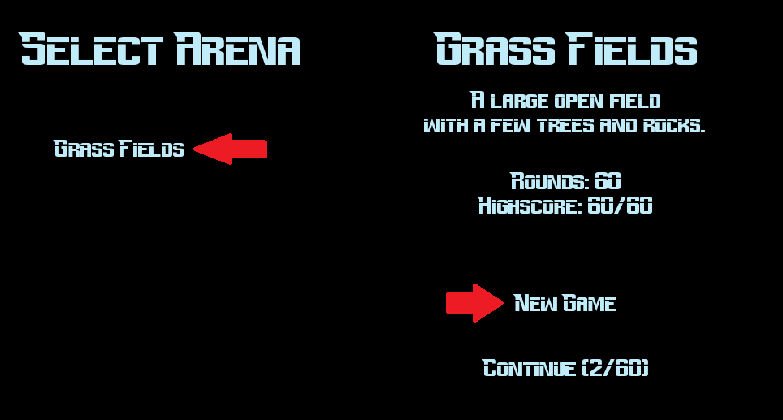
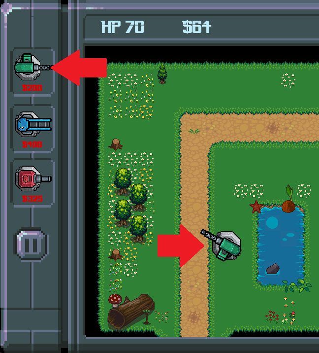
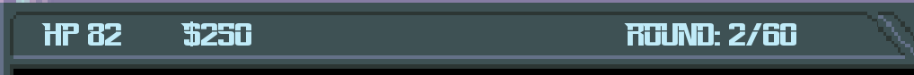

# User Guide

Download the latest release of the game: [Here](https://github.com/3nd3r1/ot-harjoitustyo/releases)

## Getting Started

### Running from Source Code

1. Install the dependencies:

    `poetry install`

2. Now you can start the game with the following command:

    `poetry run invoke start`

### Running from Packed Zip File (Windows Only)

1. Once the download is complete, extract the downloaded file to your computer.
2. Run the game by executing the file _robot_invasion_defence_2.exe_.

## Gameplay

### Objective

The goal of Robot Invasion Defence II is to defend the land from robot invasions. You must strategically build and place towers around the game field to fend off the robots.

### Starting the Game

-   After launching the game, select "Start Game" from the main menu.
    
-   Choose the arena on which you want to play.
-   Press "New Game" or "Continue."
    

### Playing the Game

-   Upon starting the game, you will be given the opportunity to build towers and other defense structures at strategic locations on the game field.

-   To build towers, click on them in the sidebar menu and then click on the desired location on the field.

-   Towers have different weapons and abilities, so you need to select towers that are best suited to the attacks you are facing. Some towers specialize in attacking certain types of enemies, while others may be more effective in specific situations.

    For example, the "Red Cannon" is most effective against "ARCHIE" robots.

-   Rounds start automatically, and waves of robots will enter the field, attempting to attack your structures. You must prevent them from reaching the end of the path by destroying them with your towers.

-   With each round, the robots become stronger and their numbers increase. You can build more defense structures to withstand the attacks.

-   Destroying robots earns you money, which you can use to buy additional towers.
    If a robot reaches the end of the path, you lose lives.
    Your money, lives, and current round number are displayed in the top bar of the view.
    

-   The game ends when you have defeated all the robots in the final round or when your lives reach zero.
