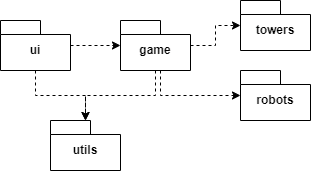
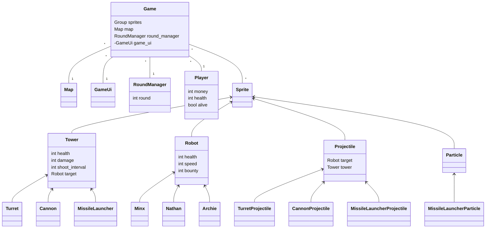
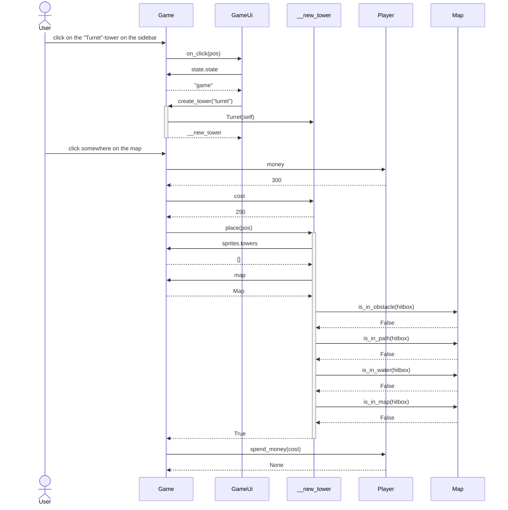

# Arkkitehtuurikuvaus

## Rakenne

### Pelin kansio-rakennetta kuvaava pakkauskaavio

-   _ui_-kansio sisältää käyttöliittymäkoodin, joka sisältää kaikki eri valikot ja _GameUi_-luokan, joka vastaa pelin aikaisesta käyttöliittymästä.

-   _game_-kansio sisältää kaiken peliin liittyvän koodin, joka sisältää spritet eli kaikki eri pelihahmot, pelikentän sekä kierroksista huolehtivan _RoundManager_-luokan.

-   _towers_-kansio sisältää eri tyyppisten tornien luokat. Jokaisella eri tyypisellä tornilla on oma luokkansa, joka perii abstraktin _Tower_-luokan.

-   _robots_-kansio sisältää eri typpisten robottien luokat. Jokaisella eri tyypisellä robotilla on oma luokkansa, joka perii abstraktin _Robot_-luokan.

-   _utils_-kansio sisältää staattista koodia, jota voidaan käyttää missä tahansa ohjelman koodissa. _utils_-kansio sisältää esimerkiksi yhteyden tietokantaan ja metodeja tiedostojen lukemiseen.

### Pelin rakennetta kuvaava luokka-diagrammi:

Tässä _Game_-luokka on pelin pääluokka, joka sisältää kaikki peliä koskevat luokat.

Abstraktit luokat _Tower_, _Robot_, _Projectile_ ja _Particle_ vastaavat kaikista "spriteistä" eli elementeistä, jotka muodostavat pelikokonaisuuden.

_Player_-luokka huolehtii kaikista pelaajaan liittyvistä asioista, kuten elämistä ja rahasta.

_RoundManager_-luokka vastaa kierroksilla syntyvistä roboteista.

_Map_-luokka vastaa pelikentän rakentamisesta ja piirtämisestä. _Map_-luokka ottaa parametrikseen areenan ja luo pelikentän sen mukaan.

_GameUi_-luokka huolehtii pelin aikaisesta käyttöliittymästä.

## Käyttöliittymä

Käyttöliittymä koostuu erilaisista valikoista ja itse pelinäkymästä.
Käyttöliittymä on jaettu kahteen pääluokkaan:

### 1. _Menu_-luokka

Tämä luokka vastaa kaikista valikoista, jotka näytetään ennen pelin aloittamista. _Menu_-luokka näyttää pelaajan tason ja rahat, ja se sisältää myös useita staattisia luokkia, jotka kuvastavat eri valikkonäkymiä, kuten päävalikkoa (_MainMenu_) ja pelin aloitusvalikkoa (_StartGameMenu_).

### 2. _GameUi_-luokka

Tämä luokka vastaa pelin aikaisesta käyttöliittymästä. _GameUi_-luokka näyttää pelaajan elämät, rahat ja kierroksen, ja se sisältää myös käyttöliittymän tornien asettamista varten. Lisäksi _GameUi_-luokka sisältää useita staattisia luokkia, jotka kuvastavat eri pelinäkymiä, kuten häviönäkymää (_LoseMenu_), voitto-näkymää (_WinMenu_) ja taukovalikkoa (_PauseMenu_).

## Pysyväistallennus

_db.py_-tiedosto sijaitsee utils-kansiossa ja sisältää metodit, jotka ovat vastuussa pelaajan tietojen tallentamisesta SQLite-tietokantaan. Tietokannan sijainti luetaan _config.py_-tiedostosta, mutta sitä voidaan muuttaa myös käyttämällä _.env_-tiedostoa, jolloin voidaan käyttää eri tietokantaa testeissä.

_.env_-tiedostossa on kaksi asetusta, jotka voidaan muuttaa tarpeen mukaan: _debug_ ja _database_pathname_.

### Tietokanta

SQLite-tietokannan rakenne on seuraava:

#### Table: player

Taulu nimeltä _player_ sisältää pelaajan yleiset tiedot. Koska lokaalissa pelissä on vain yksi pelaaja, taulukossa on vain yksi rivi, jonka pelaajan id on 1.

| Nimi       | Tyyppi  | Kuvaus                          |
| ---------- | ------- | ------------------------------- |
| id         | integer | Pelaajan yksilöllinen tunniste. |
| coins      | integer | Pelaajan rahamäärä.             |
| experience | integer | Pelaajan taso.                  |

#### Table: player_scores

Taulu _player_scores_ sisältää tiedot pelaajan saavuttamista tuloksista. Jokainen rivi kertoo yhden pelikerran tuloksen ja sisältää pelaajan id:n, areenan, jolla tulos on saatu, sekä saavutetun tuloksen.

| Nimi      | Tyyppi  | Kuvaus                                             |
| --------- | ------- | -------------------------------------------------- |
| player_id | integer | Pelaajan yksilöllinen tunniste, jota tulos koskee. |
| arena_id  | text    | Areenan tunniste, jolla tulos saavutettiin.        |
| score     | integer | Tulos, eli saavutettu kierrosmäärä.                |

#### Table: game_saves

Taulu _game_saves_ sisältää tiedot tallennetuista pelisessioista. Jokainen rivi vastaa yhtä tallennettua peliä ja sisältää pelaajan id:n, tallennetun pelin pelikentän areenan, tallennetun kierroksen numeron, spritejen tallenteen, pelaaja-olion tallenteen ja RoundManager-olion tallenteen.

| Nimi         | Tyyppi  | Kuvaus                                                 |
| ------------ | ------- | ------------------------------------------------------ |
| player_id    | integer | Pelaajan yksilöllinen tunniste, jota tallennus koskee. |
| arena_id     | text    | Areenan tunniste, jolla peli on tallennettu.           |
| round_num    | integer | Tallennetun pelin kierrosmäärä.                        |
| sprites_data | text    | Sprite-olioiden tallennettu tila.                      |
| player_data  | text    | Pelaaja-olion tallennettu tila.                        |
| rounds_data  | test    | RoundManager-olion tallennettu tila.                   |

## Päätoiminnallisuudet

### Tornin asettaminen kentälle

Kun pelaaja valitsee käyttöliittymästä uuden tornin ja klikkaa pelikenttää, sovellus etenee seuraavasti:

Ensimmäisessä vaiheessa käyttäjä klikkaa pelin sivupalkissa olevaa "Turret"-tornia, jolloin tapahtumaketju käynnistyy. Käyttäjän klikkaus välittyy pelille, joka välittää sen edelleen pelin käyttöliittymälle. Käyttöliittymä pyytää peliltä sen tilan, jonka jälkeen peli luo uuden tornin käyttöliittymän pyynnöstä.

Toisessa vaiheessa käyttäjä klikkaa kartalla paikkaa, johon uusi torni halutaan sijoittaa. Pelin täytyy tarkistaa, onko pelaajalla tarpeeksi rahaa tornin ostamiseen. Pelaaja antaa pelille tiedon saatavilla olevasta rahasummasta. Pelin täytyy myös selvittää, mikä on uuden tornin hinta. Tämän jälkeen peli pyytää uutta tornia sijoittumaan haluttuun paikkaan. Ennen kuin torni sijoitetaan, pelin täytyy varmistaa, että paikka on sallittu, eli että se ei ole esteen tai polun päällä tai vedessä. Kartta vastaa näihin kyselyihin, ja kun kaikki tarkistukset on tehty, torni sijoitetaan kartalle. Peli veloittaa pelaajalta tornin hinnan.

### Muut toiminnallisuudet

Muut toiminnallisuudet on toteutettu samalla kaavalla kuin tornin asettaminen. Pelin aikana Game-luokka käsittelee kaikki pygame-tapahtumat ja suorittaa niihin sopivat tapahtumankäsittelijät. Valikossa vastaavan käsittelyn suorittaa Menu-luokka.

## Ohjelman heikkoudet

### Käyttöliittymä

Käyttöliittymän arkkitehtuuri ei ole täysin intuitiivinen ja siinä on toistuvia elementtejä. Esimerkiksi _Menu_- ja _GameUi_-luokkien jako ei välttämättä ole optimaalinen, sillä esimerkiksi _LoseMenu_- ja _WinMenu_-luokat voisivat olla osa _Menu_-luokkaa. Lisäksi staattiset näkymät voitaisiin toteuttaa paremmin.

### Pysyväistallennus

Pysyväistallennuksen toteutus on heikoin osa ohjelman rakennetta. Lokaalin tietokannan käyttäminen ei ole välttämättä intuitiivinen ratkaisu, ja parempi vaihtoehto olisi netissä oleva tietokanta, joka sisältää kaikkien pelaajien tiedot ja johon voisi päästä käsiksi erillisellä API:lla. Lisäksi pelitallennukset voitaisiin tallentaa lokaaleihin tiedostoihin, mikä voisi olla kätevämpää

Ohjelman koodin ja tietokannan käsittelyn väliin olisi voinut lisätä PlayerRepository-luokan, joka tarjoaisi metodit pelaajatietojen käsittelyyn ilman, että ohjelma suoraan käyttää SQL-kyselyjä tietokantaan. Tämä auttaisi vähentämään koodin monimutkaisuutta ja mahdollistaisi helpomman tietokannan vaihdon tulevaisuudessa, jos se olisi tarpeen.
