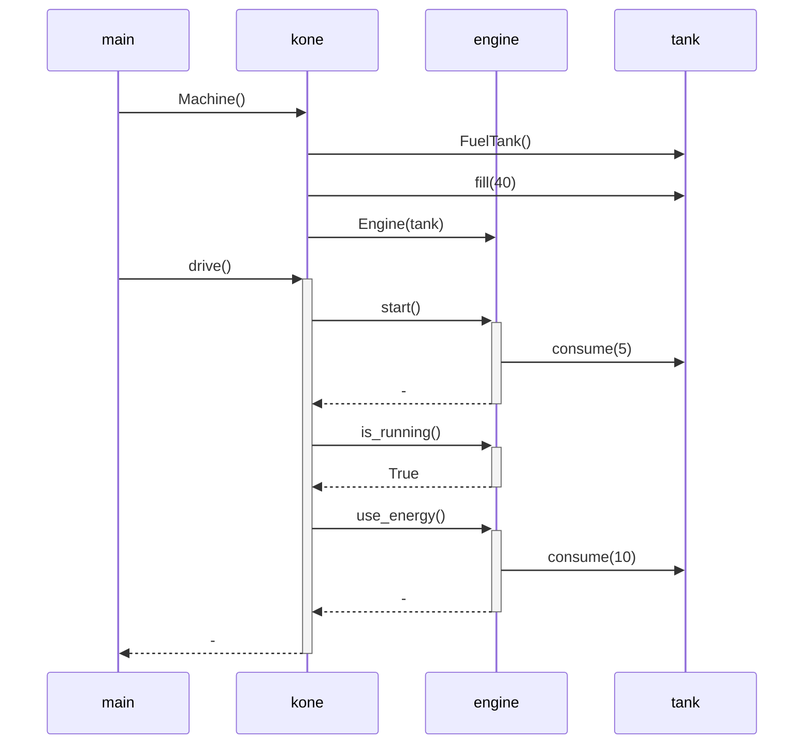

```mermaid
sequenceDiagram
    participant m as main
    participant k as kone
    participant e as engine
    participant f as tank

    m ->> k: Machine()
    k ->> f: FuelTank()
    k ->> f: fill(40)
    k ->> e: Engine(tank)
    m ->>+ k: drive()
    k ->>+ e: start()
    e ->> f: consume(5)
    e -->>- k: -
    k ->>+ e: is_running()
    e -->>- k: True
    k ->>+ e: use_energy()
    e ->> f: consume(10)
    e -->>- k: -
    k -->>- m: -
```
