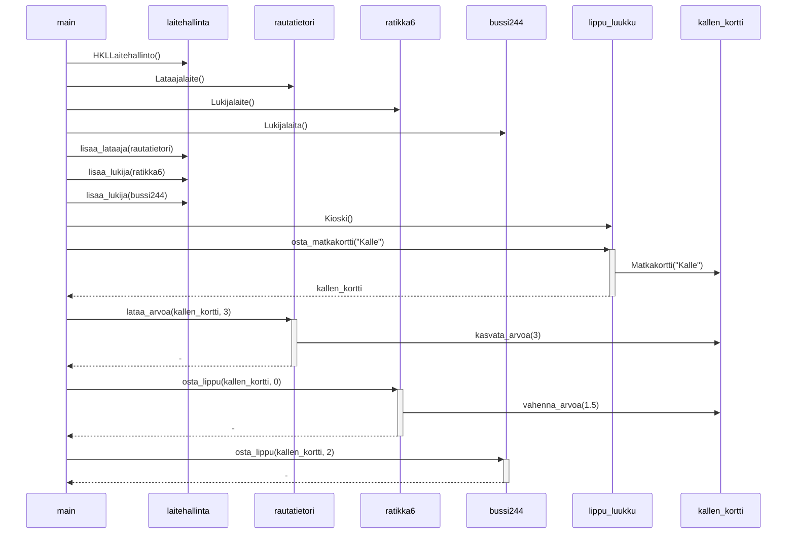

```mermaid
sequenceDiagram
    participant m as main
    participant l as laitehallinta
    participant r as rautatietori
    participant r6 as ratikka6
    participant b as bussi244
    participant k as lippu_luukku
    participant ko as kallen_kortti

    m ->> l: HKLLaitehallinto()
    m ->> r: Lataajalaite()
    m ->> r6: Lukijalaite()
    m ->> b: Lukijalaita()

    m ->> l: lisaa_lataaja(rautatietori)
    m ->> l: lisaa_lukija(ratikka6)
    m ->> l: lisaa_lukija(bussi244)

    m ->> k: Kioski()
    m ->>+ k: osta_matkakortti("Kalle")
    k ->> ko: Matkakortti("Kalle")
    k -->>- m: kallen_kortti

    m ->>+ r: lataa_arvoa(kallen_kortti, 3)
    r ->> ko: kasvata_arvoa(3)
    r -->>- m: -

    m ->>+ r6: osta_lippu(kallen_kortti, 0)
    r6 ->> ko: vahenna_arvoa(1.5)
    r6 -->>- m: -
    m ->>+ b: osta_lippu(kallen_kortti, 2)
    b -->>- m: -
```
