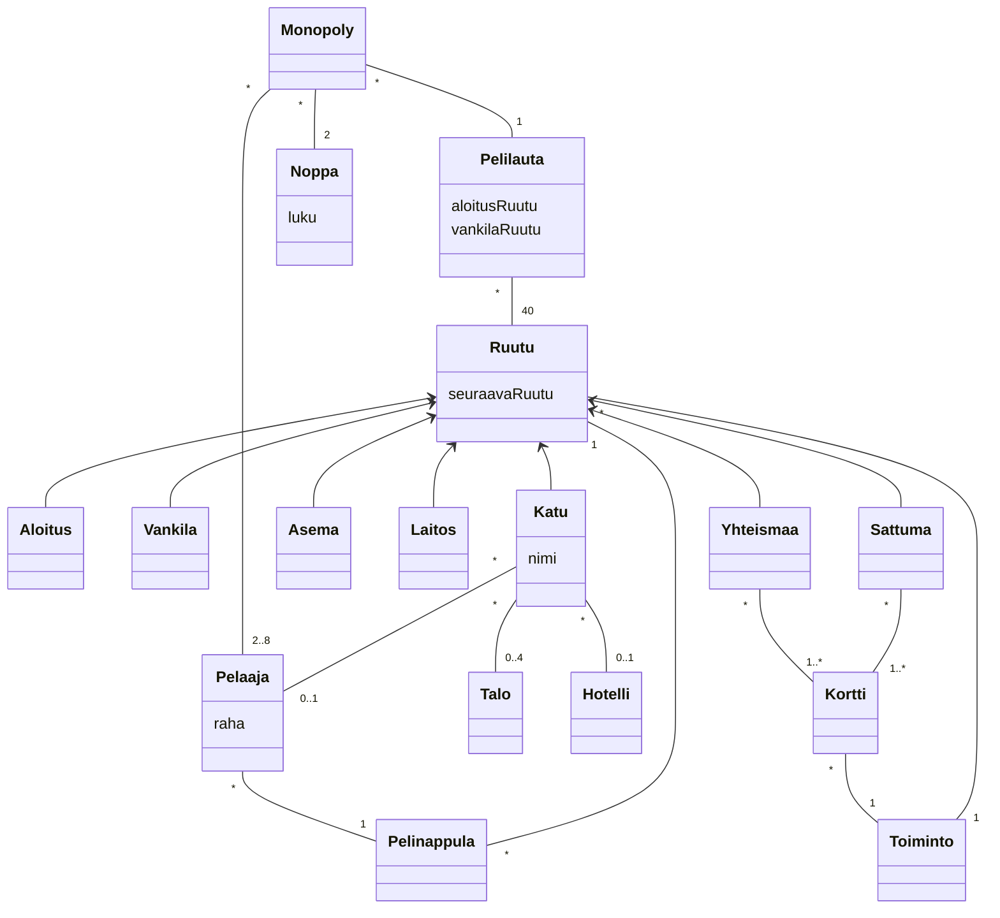

```mermaid
    classDiagram
        Monopoly "*" -- "1" Pelilauta
        Monopoly "*" -- "2..8" Pelaaja
        Monopoly "*" -- "2" Noppa
        Pelilauta "*" -- "40" Ruutu
        Pelaaja "*" -- "1" Pelinappula
        Pelinappula "*" -- "1" Ruutu
        Ruutu <-- Aloitus
        Ruutu <-- Vankila
        Ruutu <-- Katu
        Ruutu <-- Asema
        Ruutu <-- Laitos
        Ruutu <-- Sattuma
        Ruutu <-- Yhteismaa
        Katu "*" -- "0..4" Talo
        Katu "*" -- "0..1" Hotelli
        Katu "*" -- "0..1" Pelaaja
        Yhteismaa "*"--"1..*" Kortti
        Sattuma "*"--"1..*" Kortti
        Kortti "*"--"1" Toiminto
        Ruutu "*"--"1" Toiminto
        class Monopoly{
        }
        class Pelilauta{
            aloitusRuutu
            vankilaRuutu
        }
        class Ruutu{
            seuraavaRuutu
        }
        class Vankila{

        }
        class Aloitus{

        }
        class Katu{
            nimi
        }
        class Asema {

        }
        class Laitos {

        }
        class Talo{

        }
        class Hotelli {

        }
        class Kortti {

        }
        class Sattuma{

        }
        class Yhteismaa {

        }
        class Toiminto {

        }
        class Pelinappula{
        }
        class Noppa{
            luku
        }
        class Pelaaja{
            raha
        }

```
