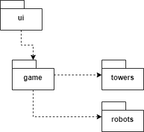
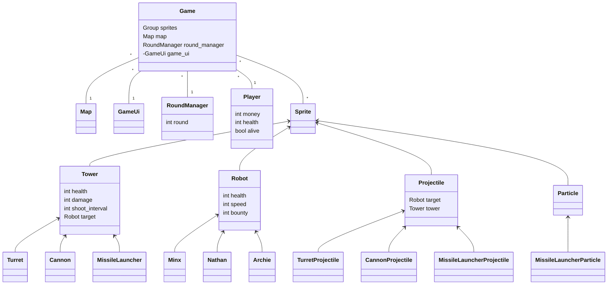
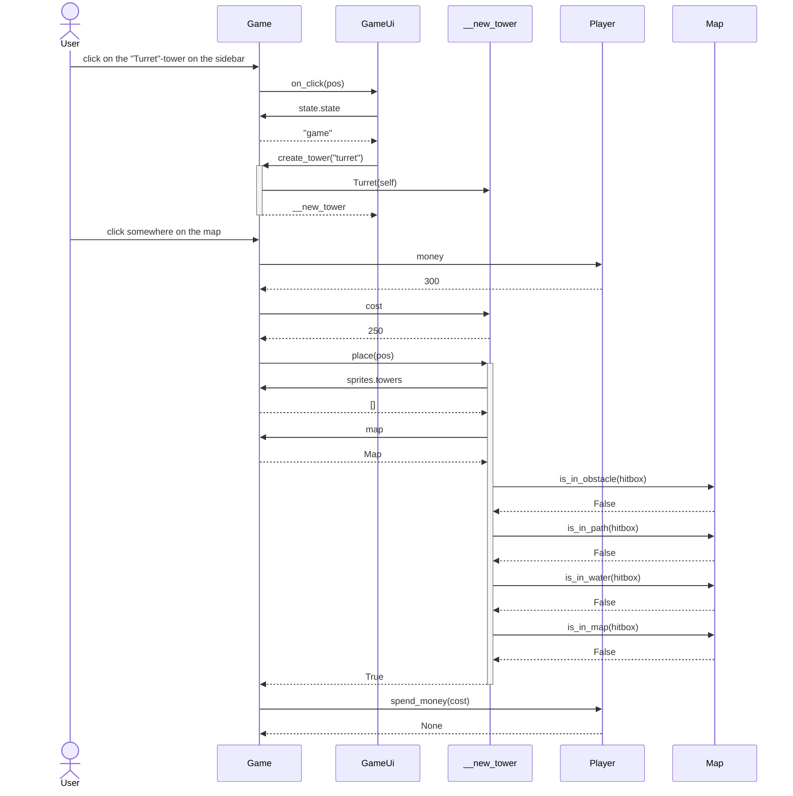

# Arkkitehtuurikuvaus

## Rakenne

### Pelin kansio-rakennetta kuvaava pakkauskaavio

-   _ui_-kansio sisältää käyttöliittymäkoodin, joka sisältää kaikki eri valikot ja _GameUi_-luokan, joka vastaa pelin aikaisesta käyttöliittymästä.

-   _game_-kansio sisältää kaiken peliin liittyvän koodin, joka sisältää spritet eli kaikki eri pelihahmot, pelikentän sekä kierroksista huolehtivan _RoundManager_-luokan.

-   _towers_-kansio sisältää eri tyyppisten tornien luokat. Jokaisella eri tyypisellä tornilla on oma luokkansa, joka perii abstraktin _Tower_-luokan.

-   _robots_-kansio sisältää eri typpisten robottien luokat. Jokaisella eri tyypisellä robotilla on oma luokkansa, joka perii abstraktin _Robot_-luokan.

-   _utils_-kansio sisältää staattista koodia, jota voidaan käyttää missä tahansa ohjelman koodissa. _utils_-kansio sisältää esimerkiksi yhteyden tietokantaan ja metodeja tiedostojen lukemiseen.

### Pelin rakennetta kuvaava luokka-diagrammi:

Tässä _Game_-luokka sisältää kaikki itse peliä koskevat luokat.
_Tower_, _Robot_, _Projectile_ ja _Particle_ ovat abstrakteja luokkia, jotka huolehtivat kaikista spriteistä eli esineistä, jotka muodostavat pelikokonaisuuden.

_Player_-luokka huolehtii kaikesta pelaajaan koskevasta, esimerkiksi elämät ja raha.

_RoundManager_-luokka huolehtii kierroksilla syntyvistä roboteista.

_Map_-luokka huolehtii pelikentän rakentamisesta ja piirtämisestä. _Map_-luokka ottaa parametrikseen areenan ja luo pelikentän sen mukaan.

_GameUi_-luokka huolehtii pelin aikaisesta käyttöliittymästä.

## Käyttöliittymä

Käyttöliittymä koostuu erilaisista valikoista ja itse pelinäkymästä.
Käyttöliittymä on jaettu kahteen pääluokkaan:

### 1. _Menu_-luokka

Tämä luokka vastaa kaikista valikoista, jotka näytetään ennen pelin aloittamista. _Menu_-luokka näyttää pelaajan tason ja rahat, ja se sisältää myös useita staattisia luokkia, jotka kuvastavat eri valikkonäkymiä, kuten päävalikkoa (_MainMenu_) ja pelin aloitusvalikkoa (_StartGameMenu_).

### 2. _GameUi_-luokka

Tämä luokka vastaa pelin aikaisesta käyttöliittymästä. _GameUi_-luokka näyttää pelaajan elämät, rahat ja kierroksen, ja se sisältää myös käyttöliittymän tornien asettamista varten. Lisäksi _GameUi_-luokka sisältää useita staattisia luokkia, jotka kuvastavat eri pelinäkymiä, kuten häviönäkymää (_LoseMenu_), voitto-näkymää (_WinMenu_) ja taukovalikkoa (_PauseMenu_).

## Päätoiminnallisuudet

### Tornin asettaminen kentälle

Kun pelaaja valitsee käyttöliittymästä uuden tornin ja klikkaa pelikenttää, sovellus etenee seuraavasti:

Ensimmäisessä vaiheessa käyttäjä klikkaa pelin sivupalkissa olevaa "Turret"-tornia, jolloin tapahtumaketju käynnistyy. Käyttäjän klikkaus välittyy pelille, joka välittää sen edelleen pelin käyttöliittymälle. Käyttöliittymä pyytää peliltä sen tilan, jonka jälkeen peli luo uuden tornin käyttöliittymän pyynnöstä.

Toisessa vaiheessa käyttäjä klikkaa kartalla paikkaa, johon uusi torni halutaan sijoittaa. Pelin täytyy tarkistaa, onko pelaajalla tarpeeksi rahaa tornin ostamiseen. Pelaaja antaa pelille tiedon saatavilla olevasta rahasummasta. Pelin täytyy myös selvittää, mikä on uuden tornin hinta. Tämän jälkeen peli pyytää uutta tornia sijoittumaan haluttuun paikkaan. Ennen kuin torni sijoitetaan, pelin täytyy varmistaa, että paikka on sallittu, eli että se ei ole esteen tai polun päällä tai vedessä. Kartta vastaa näihin kyselyihin, ja kun kaikki tarkistukset on tehty, torni sijoitetaan kartalle. Peli veloittaa pelaajalta tornin hinnan.

## Ohjelman heikkoudet

### Käyttöliittymä
