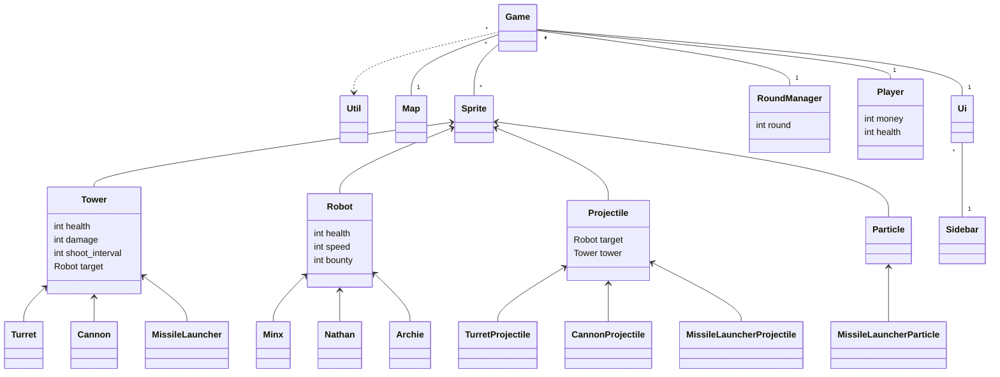

# Arkkitehtuurikuvaus

## Rakenne

### Pelin rakennetta kuvaana pakkausrakenne

_ui_ sisältää käyttöliittymä koodia
_game_ sisältää pelin koodia
_towers_ sisältää eri tyyppisten tornien koodia
_robots_ sisältää eri typpisten robottien koodia

### Pelin rakennetta kuvaava luokka-diagrammi:

## Päätoiminnallisuudet

### Tornin asettaminen kentälle

Kun pelaaja valitsee käyttöliittymästä uuden tornin ja klikkaa pelikenttää, sovellus etenee seuraavasti:

Ensimmäisessä vaiheessa käyttäjä klikkaa pelin sivupalkissa olevaa "Turret"-tornia, jolloin tapahtumaketju käynnistyy. Käyttäjän klikkaus välittyy pelille, joka välittää sen edelleen pelin käyttöliittymälle. Käyttöliittymä pyytää peliltä sen tilan, jonka jälkeen peli luo uuden tornin käyttöliittymän pyynnöstä.

Toisessa vaiheessa käyttäjä klikkaa kartalla paikkaa, johon uusi torni halutaan sijoittaa. Pelin täytyy tarkistaa, onko pelaajalla tarpeeksi rahaa tornin ostamiseen. Pelaaja antaa pelille tiedon saatavilla olevasta rahasummasta. Pelin täytyy myös selvittää, mikä on uuden tornin hinta. Tämän jälkeen peli pyytää uutta tornia sijoittumaan haluttuun paikkaan. Ennen kuin torni sijoitetaan, pelin täytyy varmistaa, että paikka on sallittu, eli että se ei ole esteen tai polun päällä tai vedessä. Kartta vastaa näihin kyselyihin, ja kun kaikki tarkistukset on tehty, torni sijoitetaan kartalle. Peli veloittaa pelaajalta tornin hinnan.

## Ohjelman heikkoudet

### Käyttöliittymä

Staattiset Menu-luokat eivät ole mieleiset. Ne saisi toteuttaa yhdessä tiedostossa.
