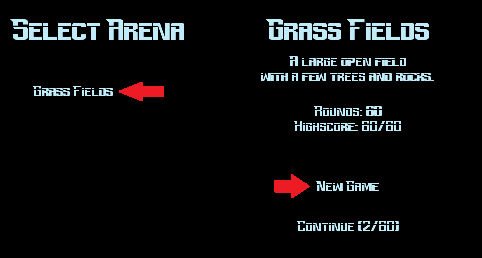
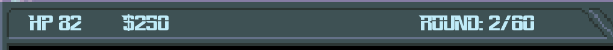

# Käyttöohje

Lataa pelin viimeisin release: [Täältä](https://github.com/3nd3r1/ot-harjoitustyo/releases)

## Käynnistäminen

### Source coden käynnistäminen

1. Navigoi pelin hakemistoon:

    `cd robot-tower-defence-2`

2. Asenna riippuvuudet:

    `poetry install`

3. Nyt pelin voi käynnistää komennolla:

    `poetry run invoke start`

### Pakatun zip tiedoston käynnistäminen (Vain Windows)

1.  Kun lataus on valmis, pura ladattu tiedosto tietokoneellesi.
2.  Käynnistä peli suorittamalla tiedosto _robot_invasion_defence_2.exe_.

## Pelaaminen

### Pelin tavoite

Robot Invasion Defence II tavoitteena on puolustaa maata robotti-hyökkäykseltä. Sinun on rakennettava ja asetettava torneja strategisesti ympäri pelikenttää torjuaksesi robotit.

### Pelin aloittaminen

-   Kun olet käynnistänyt pelin, valitse _Start Game_ päävalikosta.
    
-   Valitse areena, jolla haluat pelata.
-   Paina _New Game_ tai _Continue_
    

### Pelin Pelaaminen

-   Kun aloitat pelin, sinulle annetaan mahdollisuus rakentaa torneja ja muita puolustusrakenteita pelikentän strategisille paikoille.

-   Pääset rakentamaan torneja napsauttamalla niitä sivupalkissa olevassa valikossa ja sitten napsauttamalla haluamaasi paikkaa kentällä.

-   Tornit ovat erilaisia ja niillä on erilaisia ​​aseita ja ominaisuuksia, joten sinun on valittava torneja, jotka sopivat parhaiten hyökkäyksiin, joita vastaan taistelet. Jotkut torneista ovat erikoistuneet tietyn tyyppisiin hyökkääjiin, kun taas toiset voivat olla parempia tiettyjä tilanteita varten.

    Esimerkiksi, _punainen cannon_ on tehokkain _ARCHIE_-robotteja vastaan.

-   Roundit alkavat automaattisesti ja aaltoja robotteja tulee kentälle yrittäen hyökätä pelikentän rakenteisiin. Sinun on estettävä heitä pääsemästä polun loppuun tuhoamalla heidät torneilla.

-   Jokaisessa roundissa robotit tulevat vahvemmiksi ja niiden lukumäärä kasvaa. Voit rakentaa lisää puolustusrakenteita selvitäksesi hyökkäyksistä.

-   Robottien tuhoaminen antaa rahaa, jolla voit ostaa lisää torneja.
    Jos robotti pääsee polun loppuun menetät elämiä.
    Rahasi, elämäsi ja roundi-numeri näkyy näkymän yläpalkissa.
    

-   Peli päättyy, kun olet päihittänyt viimeisen roundin kaikki robotit tai elämäsi tippuvat nollaan.
