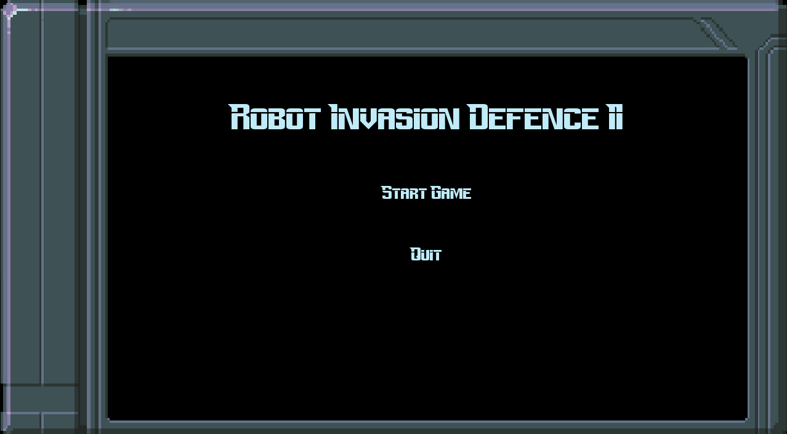
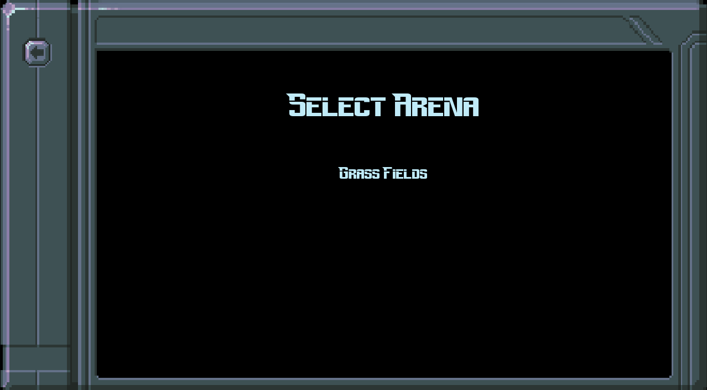
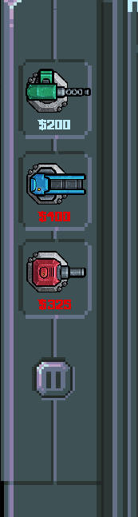

# Käyttöohje

Lataa pelin viimeisin release: [Täältä](https://github.com/3nd3r1/ot-harjoitustyo/releases)

## Käynnistäminen

Navigoi pelin hakemistoon:

`cd robot-tower-defence-2`

Asenna riippuvuudet:

`poetry install`

Nyt pelin voi käynnistää komennolla:

`poetry run invoke start`

## Pelin aloittaminen

Peli käynnistää päävalikon. Aloita peli klikkaamalla _start game_ nappia.

Valitse sitten areena, jolla haluat pelata.

## Pelaaminen

Peliä pelataan valitsemalla vasemmasta valikosta torneja joita asettaa kentälle.

Tornit ampuvat robotteja, jotka vahvenevat ja joiden määrä kasvaa jokaisella kierroksella.

Voitat pelin pääsemällä areenan viimeiseen kierrokseen, joka lukee oikeassa yläkulmassa.
