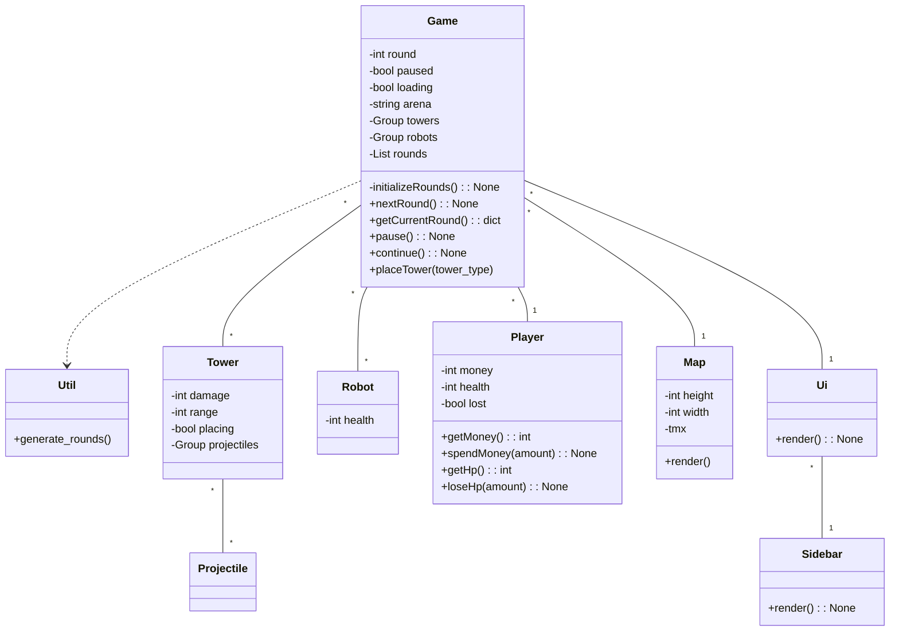

```mermaid
classDiagram
    Game ..> Util
    Game "*" -- "*" Tower
    Game "*" -- "*" Robot
    Game "*" -- "1" Player
    Game "*" -- "1" Map
    Game "*" -- "1" Ui
    Tower "*" -- "*" Projectile
    Ui "*" -- "1" Sidebar
    class Util {
        +generate_rounds()
    }
    class Game {
        -int round
        -bool paused
        -bool loading
        -string arena
        -Group towers
        -Group robots
        -List<dict> rounds
        -initializeRounds(): None
        +nextRound(): None
        +getCurrentRound(): dict
        +pause(): None
        +continue(): None
        +placeTower(tower_type)
    }
    class Player {
        -int money
        -int health
        -bool lost
        +getMoney(): int
        +spendMoney(amount): None
        +getHp(): int
        +loseHp(amount): None
    }
    class Map {
        -int height
        -int width
        -tmx
        +render()
    }
    class Tower {
        -int damage
        -int range
        -bool placing
        -Group projectiles
    }
    class Robot {
        -int health
    }
    class Projectile {

    }
    class Ui {
        +render(): None
    }
    class Sidebar {
        +render(): None
    }
```
