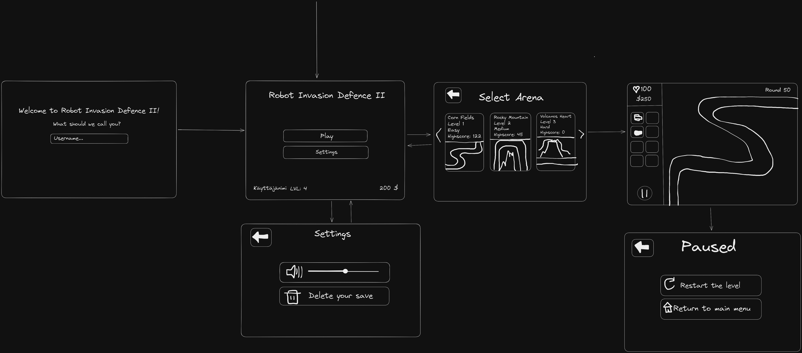

# Robot Invasion Defence 2 - Vaatimusmäärittely

## Sovelluksen tarkoitus

Sovellus on klassinen Tower Defence peli, jossa asettamalla torneja kentälle pelaaja yrittää suojautua robottien hyökkäykseltä.

Sovelluksessa on monta tornia, joita pelaaja voi käyttää pelin pelaamiseen. Esimerkiksi: turret, cannon, missile launcher jne.

Sovelluksessa on eri robotti tyyppejä eli robotteja joilta pelaaja yrittää suojautua.

Sovelluksessa on monta areenaa eli pelikenttää, joissa robottien polku on eri. Areenoilla voi olla myös muita eroja, jotka vaikuttavat pelattavuuteen.

## Käyttöliittymäluonnos

## Perusversion toiminnallisuus

### Tietojen tallennus

-   Käyttäjän tiedot tallennetaan lokaalisti SQLite-tietokantaan
    -   Tämä tiedosto sisältää käyttäjän tason ja valuutat.
    -   Tämä tiedosto sisältää pelin tallennuksia.

### Menu

-   Menu näkymässä näkyy käyttäjän perustiedot (valuutat ja taso)
-   Menu näkymästä voi valita tason jossa aloittaa pelin.

### Peli

-   Käyttäjällä on peli kohtaiset elämät
    -   Elämät näkyvät näkymässä
    -   Elämät vähenevät robottien päästessä läpi.
-   Käyttäjällä on peli kohtainen valuutta
    -   Valuutta näkyy näkymässä
    -   Valuutta kasvaa tuhotessa robotteja
-   Käyttäjä voi laittaa pelin tauolle
    -   Tauko näkymässä pelin voi lopettaa
-   Käyttäjä voi voittaa ja hävitä pelin
    -   Käyttäjä häviää, kun elämät tippuvat nollaan
    -   Käyttäjä voittaa, kun pääsee tietylle tasolle
-   Käyttäjä voi asettaa torneja
    -   Tornit toimivat

## Jatkokehitysideoita

Perusversioita täydennetään seuraavilla toiminnallisuuksilla

### Tietojen tallennus

-   Käyttäjän perustiedot tallennetaan pilveen
-   Käyttäjän pelitallennukset tallenetaan lokaaleina tiedostoina.
-   Pelaajan nimen lisääminen

### Menu

-   Menu näkymästä pääsee asetuksiin

    -   Asetuksissa voi vaihtaa äänenvoimakkuutta.
    -   Asetuksissa voi poistaa tallennus tiedoston.

-   Menu näkymästä pääsee kauppasivulle
    -   Kaupasta voi ostaa asuja pelaajan valuutalla.

### Peli

-   Lisää eri torneja:
    -   Laser
-   Lisää eri areenoita:
    -   Peaky Mountains
    -   Burning Volcano
-   Lisää eri robotteja:
-   Pikakelaus nappi
-   Käyttäjä voi muokata tornejaan:
    -   Käyttäjä voi poistaa/myydä torneja.
    -   Käyttäjä voi kehittää torneja paremmaksi.
-   Pelin kierrosten parempi generointi.
-   Robottien ja Tornien tilastojen parantaminen (balance)
